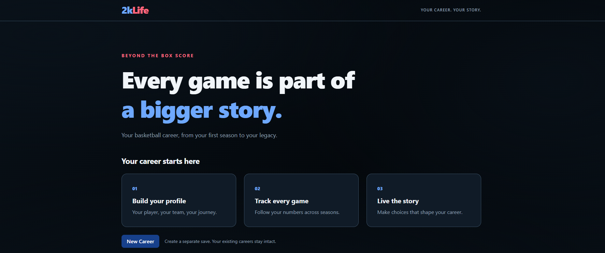
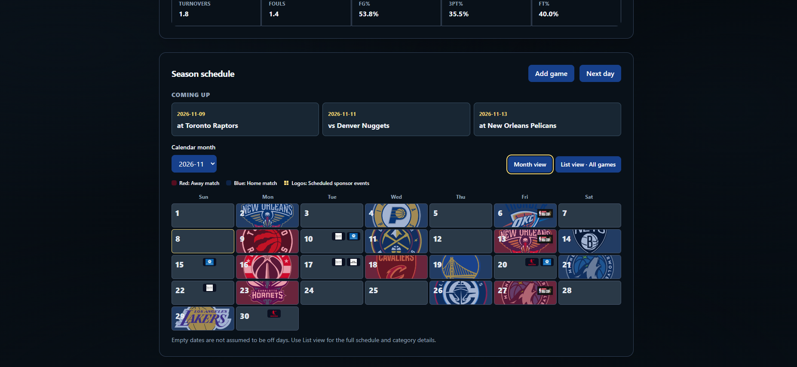
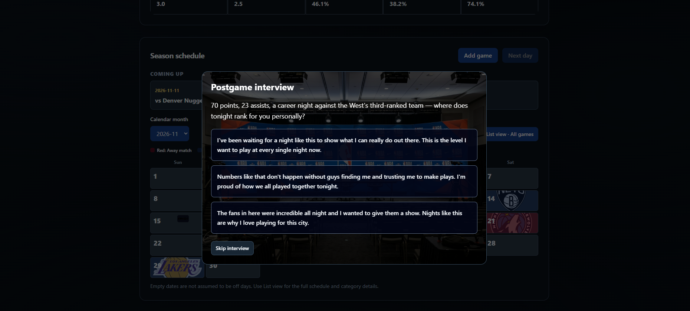
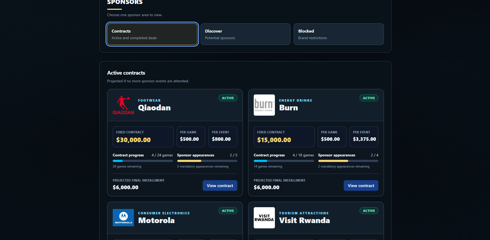
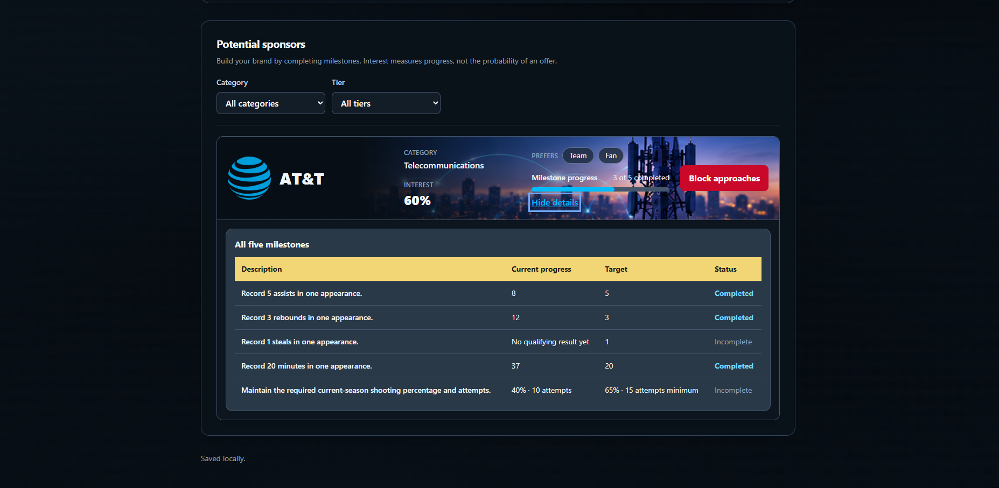
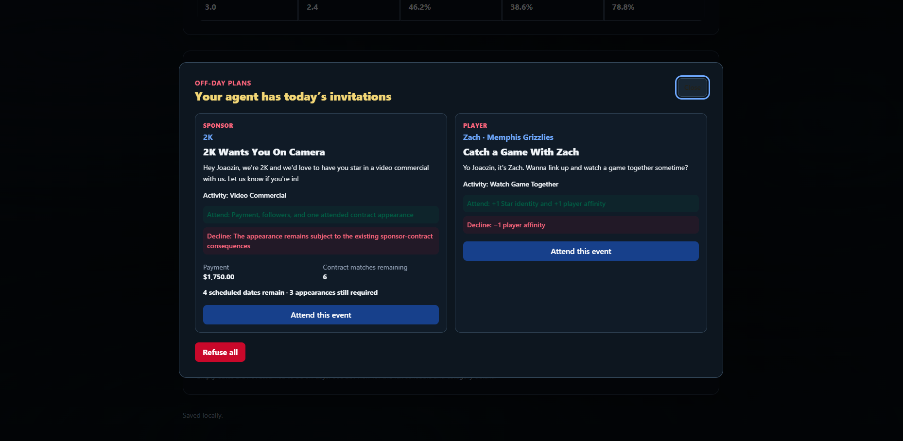
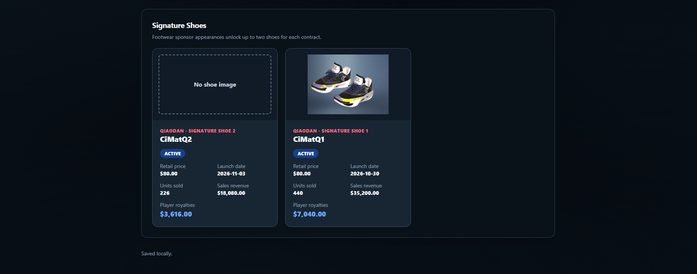

# 2kLife

2kLife is a local companion app for a single-player NBA 2K career played through **MyNBA in the Modern Era with Player Lock**. Start a MyNBA save, lock to your chosen player, and use either a created player or an existing player or legend.

2kLife adds the career context that happens around the games: interviews, personality development, followers, sponsors, off-day decisions, signature shoes, finances, records, and postseason progression.

> 2kLife does not connect to NBA 2K or read its save files. Match results and career changes must be mirrored in the app, either manually or through the supported screenshot-import flow. It is meant as a role-playing companion, so using it requires some imagination to connect the events in both experiences.

This project began as a personal idea and was built and refined with AI assistance. You are welcome to fork it, modify it, and run your own version.

2kLife is an unofficial, fan-made project. It is not affiliated with, endorsed by, or sponsored by the NBA, NBA 2K, Take-Two Interactive, Visual Concepts, any NBA team, player, sponsor, or brand shown in the app. All names, logos, and trademarks belong to their respective owners.

This app is still in development and testing. Feel free to report any bugs you encounter.



## Features

### Career and calendar

- Create a local career with the player's profile, team, draft information, season, and starting date.
- Build the NBA 2K calendar manually or import calendar screenshots through the configured AI provider.
- Track home and away games, opponents, game categories, rankings, injuries, starts, final scores, and box scores.



### Statistics and records

- Keep record season and career statistics from saved matches.
- Track single-game records for each season and across the full career.
- Display season progress, schedules, results, player information, and records.

### Interviews and personality

- Answer to post-game interviews according to your general and recent perfomances.
- Develop three personality traits through interview choices



### Followers and personal life

- Gain or lose followers from match performance.
- Track follower changes from games and off-day activities.
- Create relationships with selected players and teammates.
- Create affinity with teams.


In Version 1, affinity is tracked and displayed but does not yet affect trades or NBA contract negotiations.

### Sponsors

- Track sponsor interest based on followers, personality, and performance milestones.
- Receive approaches from footwear and general commercial brands.
- Review contract length, fixed payment, payment per match, appearance obligations, event payments, and penalties.
- Schedule sponsor appearances when a contract is signed.
- Attend or refuse sponsor invitations alongside other off-day opportunities.
- Process contract expiration, settlement, renewals, cooldowns, and permanent professionalism blocks.
- Track all sponsor income and expenses in an append-only financial ledger.

<table>
  <tr>
    <td width="50%"></td>
    <td width="50%"></td>
  </tr>
</table>

### Off-day events

- Receive sponsor, team, player, fan, and charity invitations on eligible off days.
- Choose one invitation when several events compete for the same date, or refuse all.



### Signature shoes

- Lauch your own shoe and profit from its sales.
- Name each shoe and upload an image of the shoe created inside NBA 2K.
- Track units sold, revenue, launch status, and player royalties.
- Win royalties after every eligible match.



### Postseason

- Enter and order final Eastern and Western Conference standings.
- Complete the NBA Play-In Tournament and full playoff bracket.
- Track the whole post-season, from the play-in to the NBA champion

## Planned features

These are ideas still to be implemented on this companion. Feel free to help or give more ideas

- Make player relationships and team affinity affect future career events.
- Use your network to arrange the creation of a super team.
- Add trade discussions and contract negotiations.
- Add NBA player-contract and free-agency negotiations.
- Active finaltial live, with houses, cars, and luxury itens to spend money on
- Use data from previous seasons in AI generated interviews
- Executable so anyone can run, without needing to clone a repository and installing.

## Technology

- React 19
- TypeScript
- Vite 8
- Tailwind CSS 4
- Node.js local HTTP backend
- Built-in `node:sqlite` with a local SQLite database
- Native Node test runner
- oxlint
- Optional Codex CLI or Claude integration for AI-generated content and screenshot extraction

The frontend and backend both run on local machine.

## Requirements

- [Node.js](https://nodejs.org/) 22.18 or newer
- [pnpm](https://pnpm.io/)
- Git, if cloning the repository
- Optional: Codex CLI, Claude Code CLI, or an Anthropic API key for AI features

You can enable pnpm through Corepack if it is not already installed:

```sh
corepack enable
corepack prepare pnpm@latest --activate
```

## Install and run locally

Clone the repository and enter its directory:

```sh
git clone https://github.com/CMatchelo/2kLife.git
cd 2kLife
```

Install the dependencies:

```sh
pnpm install
```

Start the frontend and local backend together:

```sh
pnpm dev
```

Open [http://127.0.0.1:5173](http://127.0.0.1:5173) in a browser.

Stop the app with `Ctrl+C`.

Both of these ports must be available:

- Frontend: `127.0.0.1:5173`
- Backend: `127.0.0.1:4319`

## Local data

2kLife creates a `.2klife` directory when it runs. It contains user-specific local data and is excluded from Git:

```text
.2klife/
  careers.sqlite
  settings.json
  signature-shoes/
  logs/
```

- Career data is stored in `.2klife/careers.sqlite`.
- AI-provider selection and test dates are stored in `.2klife/settings.json`.
- Uploaded signature-shoe images are stored under `.2klife/signature-shoes/`.
- AI credentials are not stored in the career database.

Do not commit or share the `.2klife` directory unless you intentionally want to share your personal career data.

## AI connection

AI is used for presentation and extraction tasks such as:

- Calendar screenshot import
- Postgame interview writing
- Sponsor approach messages
- Sponsor-event descriptions
- Non-sponsor event descriptions

Career rules, rewards, calculations, eligibility, and progression remain controlled by application code. AI output is validated before use, and supported text-generation features provide deterministic fallback copy.

AI features may consume subscription allowance or separately billed API usage, depending on the selected provider and authentication method.

### Codex CLI

Install the official Codex CLI and sign in:

```sh
npm install -g @openai/codex
codex login
```

Restart `pnpm dev` after installing the CLI so the backend can find it. Codex must be available in the same operating environment that runs 2kLife. If 2kLife runs in WSL, install and authenticate Codex inside WSL as well.

2kLife invokes `codex exec` locally. Subscription authentication uses the available Codex allowance; API-key authentication uses separate API billing. Credentials remain managed by the Codex CLI and should never be copied into 2kLife.

### Claude Code CLI

Install the official Claude Code CLI and sign in:

```sh
npm install -g @anthropic-ai/claude-code
claude
```

Complete browser sign-in, exit the interactive session, and restart `pnpm dev`. Leave `ANTHROPIC_API_KEY` unset to use Claude Code subscription authentication.

Claude must be available in the same operating environment that runs the backend. Credentials remain managed by Claude Code and should never be pasted into 2kLife.

### Anthropic API key

A Claude subscription does not include Anthropic API usage. This option requires separate API billing.

Copy the example environment file:

PowerShell:

```powershell
Copy-Item .env.example .env
```

macOS or Linux:

```sh
cp .env.example .env
```

Edit `.env`:

```dotenv
ANTHROPIC_API_KEY=your_api_key_here
ANTHROPIC_MODEL=claude-haiku-4-5-20251001
```

Restart the app after changing `.env`. Never prefix backend secrets with `VITE_`, because Vite variables can be exposed to the browser.

When `ANTHROPIC_API_KEY` is present, it takes precedence over Claude Code CLI authentication.

### Select and test a provider

In 2kLife:

1. Open **Connect AI**.
2. Select Codex or Claude.
3. Choose **Check configuration**.
4. Choose **Test connection**.
5. Save the provider you want to use.

Selection does not automatically verify connectivity. Connection tests consume provider allowance or API usage. There is no automatic fallback from one provider to another.

## Production build and preview

Create a production build:

```sh
pnpm build
```

Run the backend and preview server in separate terminals:

```sh
pnpm backend
```

```sh
pnpm preview
```

Open [http://127.0.0.1:4173](http://127.0.0.1:4173).

A static frontend by itself cannot access the local SQLite database or local AI providers.

## Project checks

```sh
pnpm lint
pnpm test
pnpm build
```

Automated tests use temporary or in-memory data and mocked providers. They do not require real AI credentials or consume AI usage.

## Project structure

```text
src/                 React frontend
src/career/          Career screens, dialogs, and API client
src/domain/          Shared business rules
src/types/           Shared TypeScript types
src/data/            Static sponsor catalog
server/              Local Node.js backend and SQLite services
server/providers/    Codex and Claude provider adapters
scripts/             Development scripts
spec/                Historical planning documents
.2klife/             Local runtime data, excluded from Git
```

## Security and privacy

- The frontend and backend bind to loopback addresses only.
- The backend validates the request host, origin, client header, and mutation identifiers.
- Career data and uploaded shoe images remain local unless explicitly included in an AI request.
- Calendar screenshots and selected career context are sent to the configured AI provider only when the related feature is used.
- Provider output is validated before it can affect the interface.
- The backend is intended for a trusted, single-user local machine. Do not expose it through a public tunnel.

## Official AI references

- [Codex CLI authentication](https://developers.openai.com/codex/cli/reference)
- [Codex non-interactive execution](https://developers.openai.com/codex/noninteractive)
- [Anthropic API overview](https://platform.claude.com/docs/en/api/overview)
- [Claude models](https://platform.claude.com/docs/en/models/overview)
